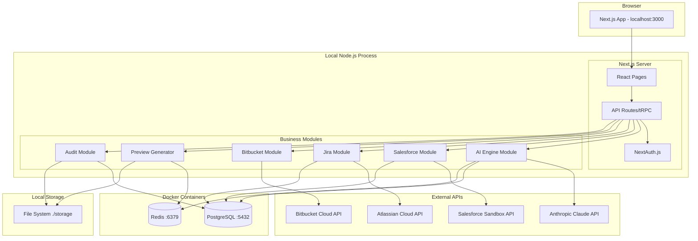

# High Level Architecture

## Technical Summary

Agentris MVP will be built as a **T3 Stack modular monolith** running entirely on **local development machines**, using **tRPC** for type-safe API communication between the Next.js frontend and backend modules. The architecture leverages **Turborepo** for monorepo management, **Prisma** with local **PostgreSQL** for data persistence, and **Redis** for caching. All modules (Jira Integration, Salesforce, AI Engine) run as part of a single Node.js process locally, with **Docker Compose** orchestrating the database and cache services. This local-first approach enables rapid MVP development and testing with real Salesforce sandboxes while deferring cloud deployment complexity. The architecture is designed to be "cloud-ready" for future deployment to Vercel/Railway/Render when needed.

## Platform and Infrastructure Choice

**Platform:** Local Development Environment  
**Key Services:**

- Next.js Dev Server (Port 3000)
- tRPC API Server (integrated with Next.js)
- PostgreSQL via Docker (Port 5432)
- Redis via Docker (Port 6379)
- Local file storage (./storage directory)
  **Deployment Regions:** Local only for MVP, US-East-1 (primary) when cloud-ready

## Repository Structure

**Structure:** Monorepo with Turborepo  
**Monorepo Tool:** Turborepo (with pnpm workspaces)  
**Package Organization:**

- apps/web (Next.js frontend + API routes)
- packages/db (Prisma schema & client)
- packages/integrations/\* (Jira, Salesforce, Bitbucket, Confluence)
- packages/ai-engine (Claude integration)
- packages/shared (types, utils, constants)

## High Level Architecture Diagram

## Architectural Patterns

- **T3 Stack Pattern:** Next.js + tRPC + Prisma for full type safety - _Rationale:_ Eliminates runtime API errors and provides excellent DX for rapid development
- **Monolithic Development:** Single process for all modules during MVP - _Rationale:_ Simplifies debugging and reduces infrastructure complexity for local development
- **File-Based Storage:** Local filesystem for documents and previews - _Rationale:_ Avoids cloud storage costs and complexity during MVP development
- **Docker Compose Services:** PostgreSQL and Redis in containers - _Rationale:_ Consistent development environment without local installation hassles
- **Environment-Based Config:** .env files for API keys and settings - _Rationale:_ Simple configuration management for local development
- **Synchronous Processing:** Direct API calls without queue systems - _Rationale:_ Simpler to debug and sufficient for single-user MVP
- **Hot Reload Everything:** Next.js fast refresh + Turborepo watch - _Rationale:_ Rapid iteration during development
- **Sandbox-First Testing:** Connect to Salesforce sandbox orgs only - _Rationale:_ Safe testing environment without production risk
